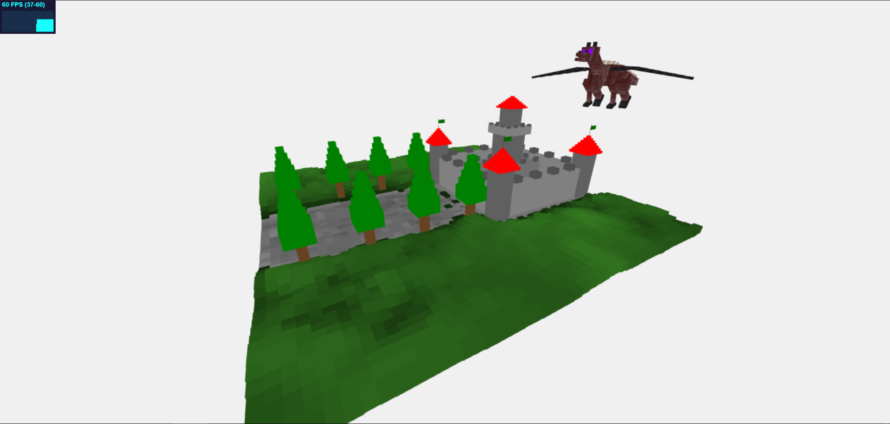
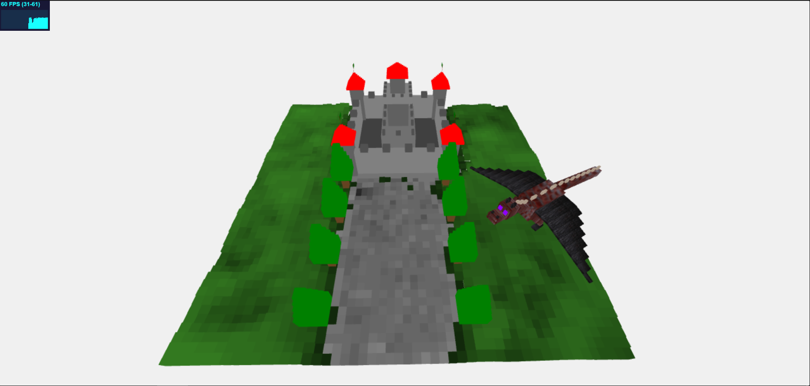
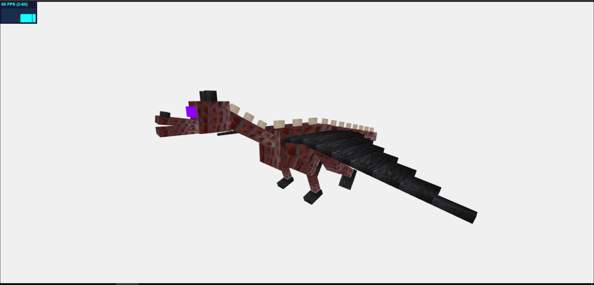
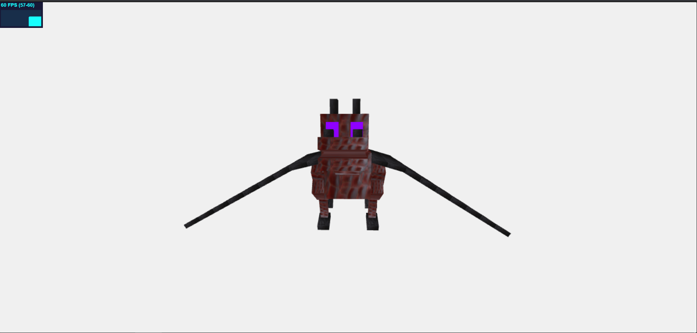
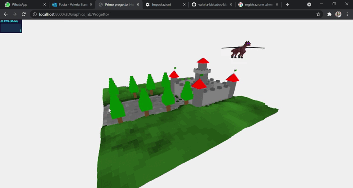

# Corso di Interactive 3D Graphics 

# Primo progetto: Cubes 

## Autori

Valeria Bianco (133886) e Alessandro Gollino (134230)

## Descrzione 

Il progetto rappresenta una scena interamente creata da cubi. Gli elementi che la compongono sono: un castello, un prato con una strada costeggiata da dei pini e un drago che vola sorvegliando il castello. 
Il prato e la strada sono stati generati attraverso una HeightMap, cioè un'immagine in scala di grigi che rappresenta le altezze.
Il drago è stato realizzato applicando delle texture su di esso. Inoltre è stata implementata l'animazione delle ali e del drago stesso che ruota sopra la scena. Ci siamo ispirati al seguente modello 3D: https://sketchfab.com/3d-models/ender-dragon-9cf16e5afd834f909a4796d1f9d4ec0c
Infine, il castello è dotato di quattro torrette di controllo ai lati più una di maggiore altezza in posizione centrale.

## Struttura del progetto 

* index.html: contiene il codice di partenza in cui vengono insiriti gli elementi e viene creato il terreno;
* Video: contine il video utilizzato per la realizzazione del README;
* immagini: contiene le immagini utilizzate per la realizzazione del README e del journal.md;
* lib: la cartella contiene le librerie *three.js* utlizzate per il progetto;
* script: la cartella contiene un file *three.js* dove sono definiti i vari elementi della scena (castello, drago e alberi);
* textures: contiene le texture del drago.

## Risultati

Vengono riportati i risultati ottenuti.

Scena al caricamento iniziale dove si possono vedere tutti gli elementi precedentemente descritti.

Scena vista da un'angolazione in cui si vede il drago muoversi.

Vista nel dettaglio del drago realizzato interamente da cubi.

Breve video della scena:

## Implementazione: 

Per prima cosa ci siamo occupati della creazione della HeightMap realizzata con l'ausilio di PhotoShop. A partire da questa è stato generato il terreno della scena assegnando alle parti più chiare il colore verde che rappresenta il prato e a quelle più scure il grigio che rappresenta la strada e il punto di appoggio del castello.
Successivamente abbiamo poi realizzato il castello e il drago inidpendentemente e poi collocati nella scena.
Il drago è stato animato in modo che percorresse una traiettoria circolare sopra la scena. Inoltre, alle ali è stato dato il movimento tipico delle creature volanti: ciò è stato realizzato imponendo una rotazione limitata. 
Gli alberi sono stati posizionati ai lati della strada che conduce alla fortezza. Quest'ultima è formata da quattro torri di controllo posizionate ad ognuno degli angoli. Inoltre, vi è una casa centrale dotata di una torre più alta di controllo.

## Credits:

Modello ispirazione drago:  https://sketchfab.com/3d-models/ender-dragon-9cf16e5afd834f909a4796d1f9d4ec0c
